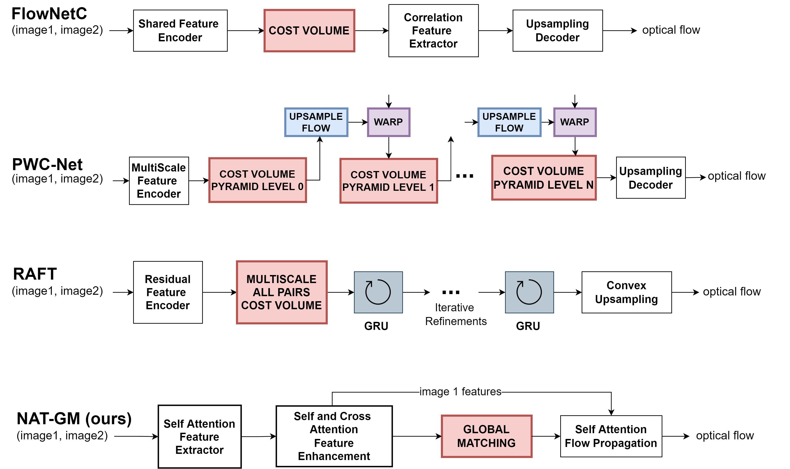

## Exploring Training Recipes and Transformer Neural Networks for Optical Flow Estimation

[[official thesis report(coming soon)]](https://github.com/prajnan93/optical-flow-msthesis/blob/main/README.md)  |  [[unpublished thesis draft]](https://tinyurl.com/prajnan-ms-thesis-draft)

This thesis makes the following contributions:
- An emperical study of pre-training, dataset scheduling and data augmentations on **four generations of optical flow models** to provide a common training recipe. 
- Understanding the efficacy of Transformer Neural Networks for the optical flow estimation task.

The majority of the code is supported by the [EzFlow](https://github.com/neu-vi/ezflow) PyTorch Library which was developed as a prerequsite for the thesis study. This repository contains the training configuration files for all the experiments and the implementation of **NAT-GM** and **SCCFlow** [_end-to-end transformer_](https://github.com/prajnan93/optical-flow-msthesis/tree/main/nnflow/models) architectures for optical flow estimation.
____

### Four Generations of Optical Flow Models

     
    
     

____

The pretrained checkpoints for the improved results will be published in the [EzFlow](https://github.com/neu-vi/ezflow) repository.

____

### References

- [FlowNet: Learning Optical Flow with Convolutional Networks](https://arxiv.org/abs/1504.06852)
- [PWC-Net: CNNs for Optical Flow Using Pyramid, Warping, and Cost Volume](https://arxiv.org/abs/1709.02371)
- [RAFT: Recurrent All-Pairs Field Transforms for Optical Flow](https://arxiv.org/abs/2003.12039)
- [GMFlow: Learning Optical Flow via Global Matching](https://arxiv.org/abs/2111.13680)
- [Disentangling Architecture and Training for Optical Flow](https://arxiv.org/abs/2203.10712)
- [ViT: Vision Transformer](https://arxiv.org/abs/2010.11929)
- [Swin Transformer: Hierarchical Vision Transformer using Shifted Windows](https://arxiv.org/abs/2103.14030)
- [Dino ViT: Emerging Properties in Self-Supervised Vision Transformers](https://arxiv.org/abs/2104.14294)
- [Deep ViT Features as Dense Visual Descriptors](https://arxiv.org/abs/2112.05814)
- [Neighborhood Attention Transformer](https://arxiv.org/abs/2204.07143)
- [Dilated Neighborhood Attention Transformer](https://arxiv.org/abs/2209.15001)
- [Kubric](https://github.com/google-research/kubric/tree/main/challenges/optical_flow)
