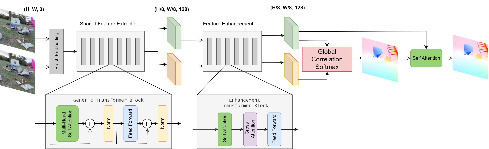

## End-to-end Transformer for Optical Flow

Adaptation of **[GMFlow](https://arxiv.org/abs/2111.13680)** architecture to build an end-to-end transformer architecture for optical flow estimation. The configuration files for the transformer models are available in: https://github.com/prajnan93/optical-flow-msthesis/tree/main/configs/transformers/models

Original implementation of GMFlow: https://github.com/haofeixu/gmflow

____

## NAT-GM | Neighborhood Attention Transformer with Global Matching

     
    
     

____

## SCCFlow | Self-Cross Correspondence Flow

     
    
     

